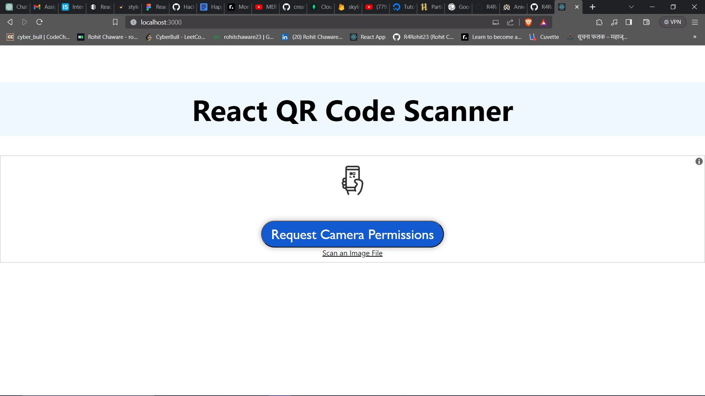
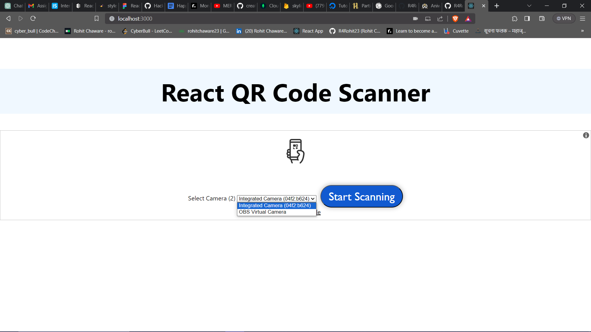

 # 📱 QR Code Scanner Using React.js 


## 🚀 Installation

1.  **Fork the Repository**

   - Click the `Fork` button at the top-right corner of this repository. This creates a copy of the repository in your GitHub account.

2.  **Clone Your Fork**

   - `Clone` the forked repository to your local machine:

     ```
     git clone https://github.com/username/your_repo_name.git
     ```

3.  **Install the essential packages**

     ```
     npm install
     ```

4.  **Run the project**

     ```
     npm start
     ```


## 📌 Steps to run

1. **Go to the endpoint serving your application i.e locahost**

    ```
    http://localhost:3000
    ```

2. **Give Camera Access**
    

3. **Choose camera**
    

4. **If you want to scan QR file**
    

5. **Success Message**
    